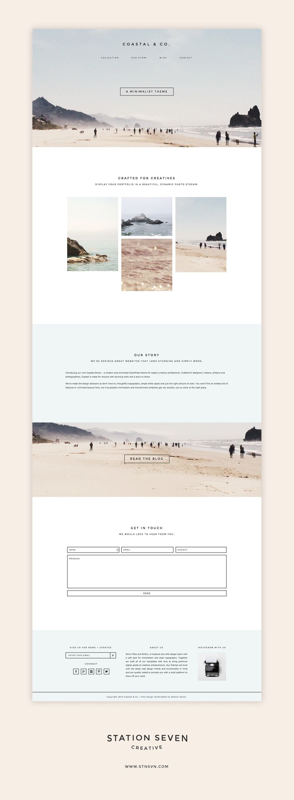

# chi-wdi-10-fluff-hounds

---
Title: HTML Mockup  
Type: Morning Exercise 
Duration: "0:45" 
Instructor:Kristyn Bryan 
Modified from Lab Created by: Matt Huntington
    Course: WDIR-Hopper 
Competencies: HTML  
Prerequisites: Basic HTML  

---
# Morning Exercise

## Directions
Look at the mockup below and create a webpage **with this layout** using HTML and the images provided (note, the images provided are not the same as the ones in the mockup).

**Important for today:**
- Get your HTML elements on the page.
- Think about which semantic tags you can use (`section`, `main`, `header`, `footer`, `paragraph`, which heading tags should you use?).

NOTE: This may or may not be a 2-day exercise.

## Setup
1. Go to fluff-hounds.  `mkdir 12_11_2017_Objects`
2. **Create a folder**  called `am_mockup_exercise`.
3. Navigate inside the `am_mockup_exercise` folder and create an our folder structure.

**IMPORTANT** As you code, make sure to check your work in the browser.

## Mockup (for the structure)

## The Resources
1. You are being provided with 5 pictures (located in the images folder inside this `morning_exercise` folder.
1. For the "GET IN TOUCH" section, you may need to do some research to create form elements for name, email, subject, message, send.  Slack me or Julian or ask us in person if you have questions.

## Stretch:
1. Connect a CSS file to the HTML file and start changing the background color, moving images, etc.
1. Research form elements and add them in to match the mockup
1. Don't worry about matching the fonts exactly, but check out some [standard fonts](https://developer.mozilla.org/en-US/docs/Web/CSS/font-family) in CSS or [Google Fonts](https://fonts.google.com/).

_Images from: http://wwww.rowanmersh.com/gallery-category/2017/_
